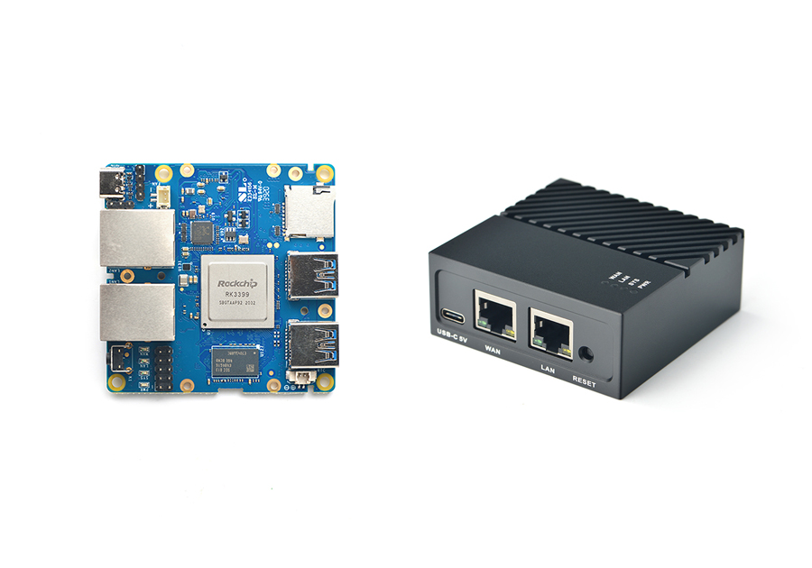
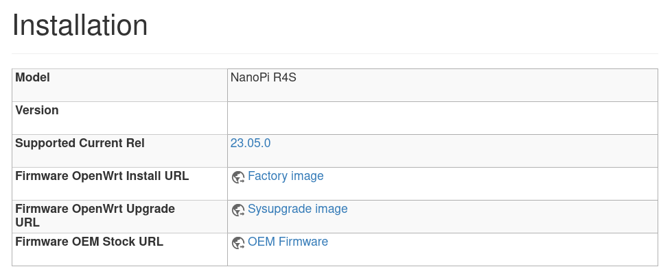
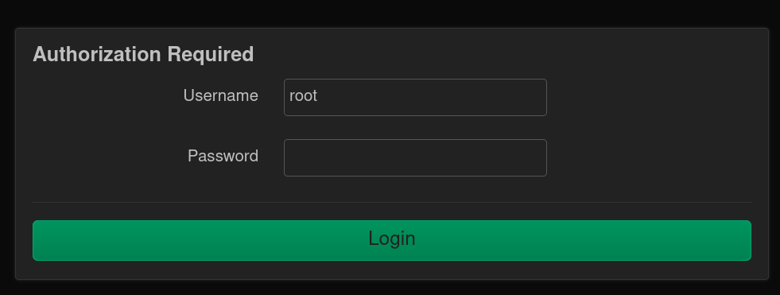
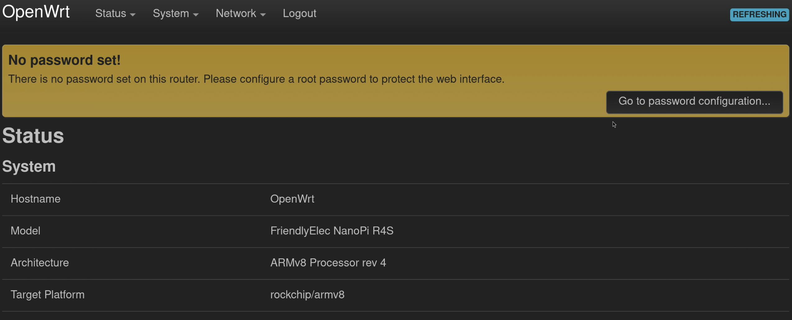
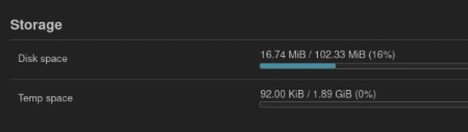
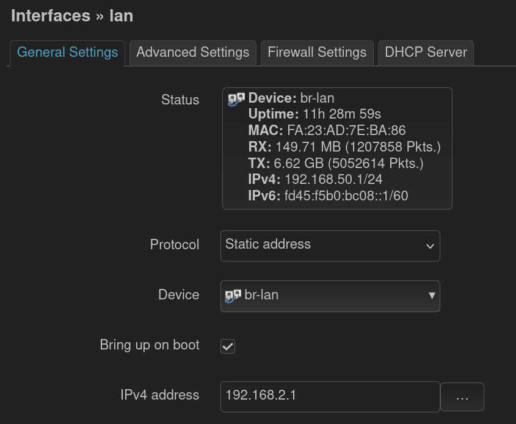
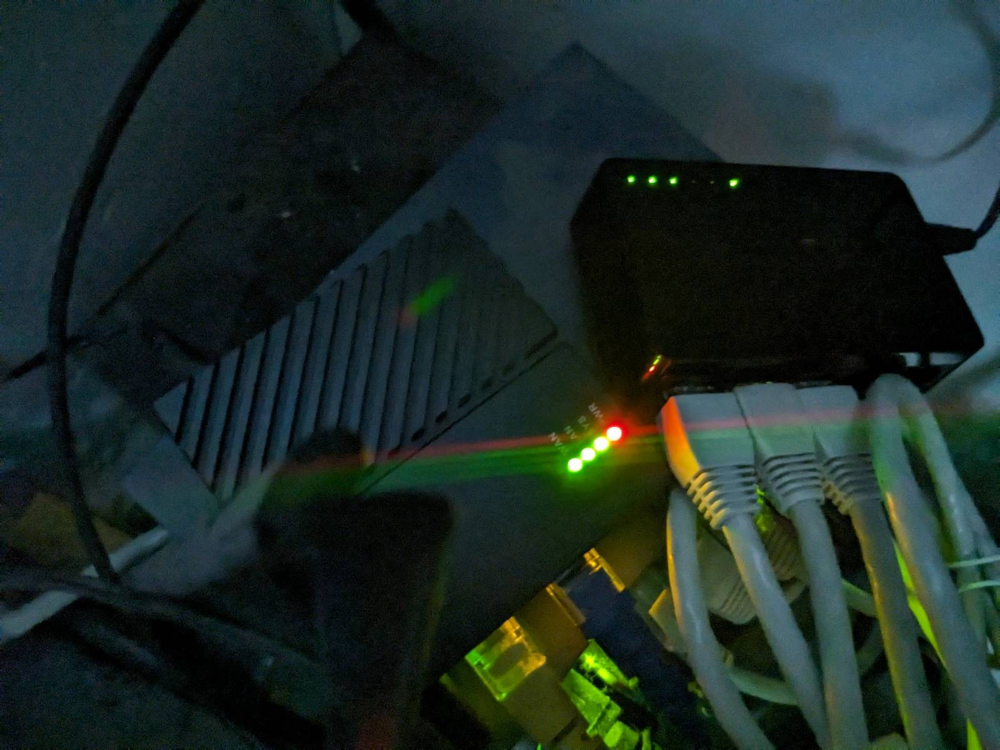

# Algunas palabras

- *Computadora*: Cualquier dispositivo electrónico que implemente
  la arquitectura von Neumann.
- *Firmware*: Pieza de software de bajo nivel que controla el funcionamiento de
  una computadora.
- *Router*: una computadora que forma parte de una red y que se encarga de
  comunicar una *LAN* con una *WAN*.
- *Switch*: es un aparato que, dentro de una misma red, conecta a los clientes
  de la misma.
- *Punto de acceso inalámbrico (WAP)*: Dispositivo que se encarga de proveer una
  conexión WiFi a las computadoras de una red.
- *Firewall*: Dispositivo (ya sea hardware o software) que bloquea o permite el
  paso de paquetes de red según ciertas reglas.

# ¿Qué es OpenWRT?

OpenWRT es un sistema operativo basado en el kernel de Linux diseñado para su
uso en sistemas embebidos, específicamente aquellos cuyo propósito sea el manejo
de tráfico en una red. Se trata de, quizás, una de las distribuciones de Linux
más conocidos para su uso en *routers* y puntos de acceso domésticos.

# Historia

El proyecto surgió a raíz del código fuente un *router* Linksys *WRT54G*.
Andrew Miklas descubrió que el *firmware* que el dispositivo
contenía el código de muchos proyectos publicados bajo la licencia
GPL. 

# Diferencias con otros sistemas


OpenWRT se enfoca en su uso para computadoras embebidos. El tipo de computadoras
utilizadas en estos sistemas suele ser de "baja velocidad".

Por necesidad, OpenWRT es un sistema mucho más ligero que la mayoría de las
alternativas. No son necesarios más que 8 MB de almacenamiento y 64 MB de
memoria RAM para un funcionamiento estable.


# El papel de OpenWRT en una red doméstica

Dadas sus características y objetivos de desarrollo, OpenWRT es ideal para su
instalación en *routers* caseros cuyo *firmware* no de el ancho, sea demasiado
antiguo como para considerarse seguro, o para "liberar" la red de una casa.

OpenWRT existe puede utilizarse para traer capacidades más modernas a
un antiguo *router*, o para convertir una computadora común en un *router*.

Por ejemplo, puede utilizarse una computadora con OpenWRT para que, además de
cumplir su función como *router*, ejecute otro software y funcione como servidor
en la red local.

# Ejemplo de uso en la casa de uno de los expositores

El *router* de la casa de uno de los expositores tiene software ya viejo: la
última actualización de *firmware* para el mismo ya tiene cuatro años de
antigüedad.

Se compró una nueva computadora para instalar el sistema ahí.

Una NanoPi R4S, que cuenta con 4 GB de memoria RAM y un procesador *ARM* de seis
núcleos. Se compró una memoria micro SD de 32GB para almacenamiento.

La NanoPi nueva no cuenta con capacidades inalámbricas, por
lo que se utilizará al viejos Asus como punto de acceso inalámbrico.


# NanoPi R4S

{width=300px}

# Instalación



```sh
gzip -d openwrt....img.gz
sudo cp openwrt....img /dev/la-mem
```

# Iniciando sesión



# Cambiando la contraseña del superusuario



# Expandiendo el sistema de archivos

{height=100px}

{height=100px}

# Cambiar dirección IP del *router*

{height=250px}

# Conexión a la *WAN*

{height=250px}

# Usando el viejo *router* como *WAP*


# Pruebas de uso

```
$ ping gwolf.org
PING gwolf.org (...) 56(84) bytes of data.
64 bytes from ...
...
^C
--- gwolf.org ping statistics ---
4 packets transmitted, 4 received...
rtt min/avg/max/mdev = 56.603/56.68...
```

# Conclusiones

Fue posible ver cómo OpenWRT puede utilizarse en una red casera.

Conocer sistemas como estos nos ayuda a darnos cuenta de que el *firmware*
incluido de fábrica no es la única opción para gestionar una red doméstica.

La instalación también sirve como un buen proyecto para aprender algunos
conceptos básicos sobre la administración de sistemas y sobre redes de
computadoras.

# Fuentes consultadas

Las fuentes consultadas se detallan en el reporte adjunto a esta presentación.
