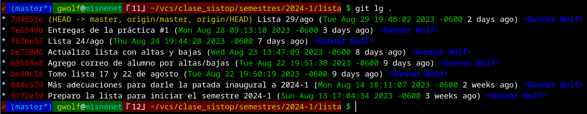
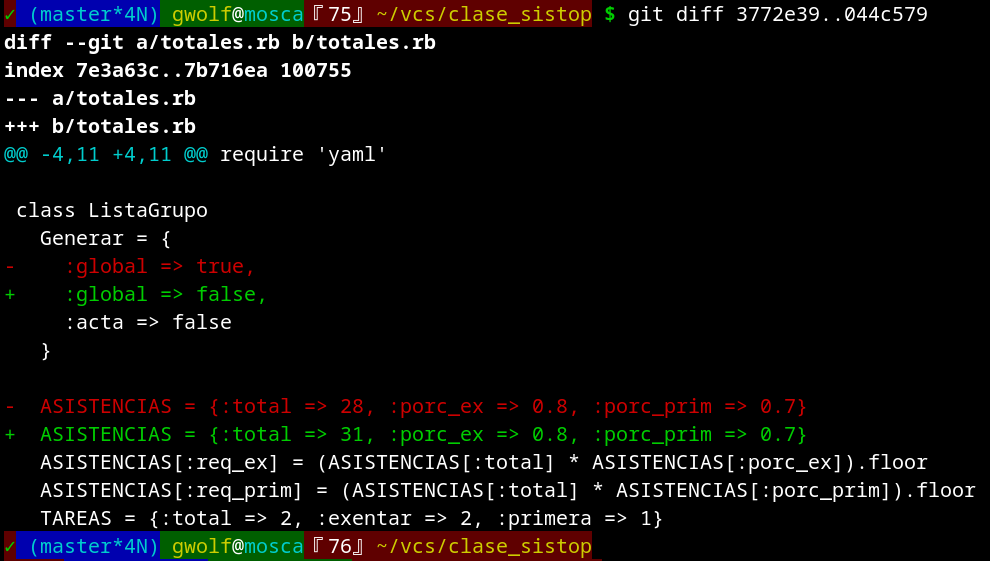

# Práctica 3: ¡Mis proyectos evolucionan!

	Práctica creada: 2024.02.29
	Entrega en tiempo: 2024.03.07

## Un proyecto implica avance

En el transcurso del desarrollo de tus proyectos, cada uno de los _objetos_ que
lo constituyen (digamos, por simplicidad, cada uno de los _archivos_) va
registrando avances. Y muchas veces nos produce _ansiedad_ modificar un pedazo
de código, un párrafo de texto o una imagen por el trabajo que le
invertimos... ¿Y si no nos queda bien?

Es por eso que muchas veces nos encontramos con directorios llenos de archivos
que incluyen:

    Proyecto_2.c
	Proyecto_2.atorado.c
	Proyecto_2.con_apuntadores.c
	Proyecto_2.con_arreglos.c
	Proyecto_2.corregido.c
	Proyecto_2.EL_BUENO.c
	Proyecto_2.Final.c
	Proyecto_2.V2.c

¿Cual de estas versiones es verdaderamente **la buena**? Es más... ¿Para qué
tenemos tantas versiones?

Git nos brinda la oportunidad de liberarnos de toda esa molesta historia, y
tener una *verdad única*, ¡y sin perder la historia, manteniendo la capacidad de
volver a cualquier punto en el tiempo!

Les presento como ejemplo el repositorio que uso para control de asistencias del
grupo. Usando el comando que vimos en nuestra práctica anterior:

	$ git log --all --graph --oneline --pretty=format:'%h <%an> %s %Cgreen%d'

(O con el alias que yo establecí, `git lg`, que es equivalente):

(adjunté una imagen en vez de copiar únicamente el texto para poder referirme
más fácilmente a las partes; más adelante lo haré únicamente con el texto
copiado)

¡Ojo! El puntito solitario que le indiqué a `git log` (o, en este caso, a
`git lg`, que lo "envuelve" y pasa a `git log`) le indica que me entregue los
resultados relevantes únicamente para el directorio actual, `.`

## ¿Cómo interpretar la historia de Git?

La columna que aparece en rojo tiene el _identificador de cada commit_. Lo que
se nos presenta es una cadena corta (en este caso, de 7 dígitos hexadecimales)
de *la suma SHA1 identificadora* de cada commit. Esta es una abreviación (la
suma completa mide 40 caracteres), pero es suficiente para expresar _sin
ambigüedad_ a cada uno de los commits. (¡Pero no se preocupen! Rara vez las
usamos directamente)

En amarillo, tenemos las ramas locales y remotas (o las _cabezas_) de nuestro
repositorio. Cada rama es, en realidad, sólo el apuntador con un nombre amigable
al humano a un *commit* específico.

Lo demás no es tan relevante para esta práctica, aunque sí es importante en
general. En verde tenemos la fecha, en azul el nombre del autor, y en blanco la
descripción del commit.

## Pónganse los cinturones, ¡que vamos a despegar!

Como paso previo a _viajar en el tiempo_, asegúrense de que no haya tiradero:
Procuren que no haya archivos _tirados_ en el repositorio — pendientes de ser
incorporados a ser gestionados por Git. Si los hay, pueden moverlos hacia afuera
de éste con las herramientas que más les acomoden. Si hay cambios en archivos
que forman parte de Git, pueden hacer _commit_... ¡Pero dejen su repositorio en
un estado tan limpio como sea posible!

Tomé los ejemplos que ilustran esta práctica al inicio del semestre 2024-1, por
lo que verán muchas referencias a agosto-septiembre de 2023.

## Y volver, volver. volver...

Puedo volver a un punto en el tiempo con su número de commit. Por ejemplo, si
quiero recuperar mi lista limpia y vacía, puedo volver al commit del 14 de
agosto, _Más adecuaciones para darle la patada inaugural a 2024-1_:

    $ git checkout 044c579
	Note: switching to '044c579'.
	
	You are in 'detached HEAD' state. You can look around, make experimental
	changes and commit them, and you can discard any commits you make in this
	state without impacting any branches by switching back to a branch.
	
	If you want to create a new branch to retain commits you create, you may
	do so (now or later) by using -c with the switch command. Example:
	
	  git switch -c <new-branch-name>

    Or undo this operation with:

      git switch -

    Turn off this advice by setting config variable advice.detachedHead to false

	HEAD is now at 044c579 Más adecuaciones para darle la patada inaugural a 2024-1

Veré únicamente los archivos que existían en ese punto en el tiempo. Si ahora
pido nuevamente `git lg`, veré que la cabeza anónima de rama sobre la cual
estoy trabajando (`HEAD`) apunta al commit que solicité. Para ver nuevamente la
historia completa del repositorio _en el directorio actual_ tengo que
especificar el switch `--all`:

    $ git lg
	* 044c579 (HEAD) Más adecuaciones para darle la patada inaugural a 2024-1 (Mon Aug 14 18:11:07 2023 -0600 2 weeks ago) <Gunnar Wolf>
    * 3772e39 Preparo la lista para iniciar el semestre 2024-1 (Sun Aug 13 17:04:34 2023 -0600 3 weeks ago) <Gunnar Wolf>
    $ git lg --all
	* 7d4651e (origin/master, origin/HEAD, master) Lista 29/ago (Tue Aug 29 19:48:02 2023 -0600 2 days ago) <Gunnar Wolf>
    * 7e6949b Entregas de la práctica #1 (Mon Aug 28 09:13:10 2023 -0600 3 days ago) <Gunnar Wolf>
    * f67be57 Lista 24/ago (Thu Aug 24 19:44:20 2023 -0600 7 days ago) <Gunnar Wolf>
    * be75006 Actualizo lista con altas y bajas (Wed Aug 23 13:47:09 2023 -0600 8 days ago) <Gunnar Wolf>
    * 63568a8 Agrego correo de alumno por altas/bajas (Tue Aug 22 19:51:38 2023 -0600 9 days ago) <Gunnar Wolf>
    * be49c58 Tomo lista 17 y 22 de agosto (Tue Aug 22 19:50:19 2023 -0600 9 days ago) <Gunnar Wolf>
    * 044c579 (HEAD) Más adecuaciones para darle la patada inaugural a 2024-1 (Mon Aug 14 18:11:07 2023 -0600 2 weeks ago) <Gunnar Wolf>
    * 3772e39 Preparo la lista para iniciar el semestre 2024-1 (Sun Aug 13 17:04:34 2023 -0600 3 weeks ago) <Gunnar Wolf>
	$

Claro, cuando por alguna razón muevo mi `HEAD`, es importante volver a la rama
en la que estoy trabajando. Para volver a la rama principal:

	$ git checkout master

Git nos permite también referirnos a cada *commit* de forma relativa al punto
de la historia del repositorio desde donde estamos trabajando con el caracter
`~` para referirnos a commits anteriores; este caracter puede repetirse para
*apuntar* a generaciones anteriores. Veamos, partiendo desde `master`:

    $ git checkout HEAD~~
    Note: switching to 'HEAD~~~'.
	(...)
    HEAD is now at f67be57 Lista 24/ago
	$ git lg --all
	* 7d4651e (origin/master, origin/HEAD, master) Lista 29/ago (Tue Aug 29 19:48:02 2023 -0600 2 days ago) <Gunnar Wolf>
    * 7e6949b Entregas de la práctica #1 (Mon Aug 28 09:13:10 2023 -0600 4 days ago) <Gunnar Wolf>
	* f67be57 (HEAD) Lista 24/ago (Thu Aug 24 19:44:20 2023 -0600 7 days ago) <Gunnar Wolf>
	* be75006 Actualizo lista con altas y bajas (Wed Aug 23 13:47:09 2023 -0600 8 days ago) <Gunnar Wolf>
	* 63568a8 Agrego correo de alumno por altas/bajas (Tue Aug 22 19:51:38 2023 -0600 9 days ago) <Gunnar Wolf>
	* be49c58 Tomo lista 17 y 22 de agosto (Tue Aug 22 19:50:19 2023 -0600 9 days ago) <Gunnar Wolf>
	* 044c579 Más adecuaciones para darle la patada inaugural a 2024-1 (Mon Aug 14 18:11:07 2023 -0600 2 weeks ago) <Gunnar Wolf>
	* 3772e39 Preparo la lista para iniciar el semestre 2024-1 (Sun Aug 13 17:04:34 2023 -0600 3 weeks ago) <Gunnar Wolf>
	$ git checkout HEAD

**OJO:** Tengo que reconocer que en este punto estoy simplificando. Cuando la
historia del repositorio se bifurca mucho, como es el caso del que tenemos para
la materia, no siempre resulta intuitivo *cuál de los commits padre* es la línea
que estamos siguiendo. En dado caso, sugiero utilizar las referencias al
*commit* descritas anteriormente.

## ¿Cuál es la diferencia entre dos commits?

Muchas veces no querremos *volver en el tiempo*, sino comparar dos diferentes
*commits*. Para eso tenemos a `git diff`. Si nuestros archivos son textuales (no
PDF, DOCX ni otros formatos binarios), nos presentará de una forma simple y
clara de entender qué cambios hubo, *sin mudar el punto en el que
estamos*. Puedo darle dos commits, o dos referencias relativas, y me indicará
(siempre y cuando la terminal implemente salida a color):

- Cada *commit* puede incluir varios archivos. `diff` presenta un pequeño
  encabezado describiendo a cada uno de estos.
- El archivo en el primer *commit*, indicado por la letra `a`, y en el segundo,
  indicado por `b`.
- En celeste y entre signos `@@`, el número de línea del archivo donde ocurre
  este cambio
- En verde, las líneas que se agregaron
- En rojo, las líneas que se suprimieron:

## Ahora sí, ¡la práctica!

¿Qué vamos a hacer para esta práctica? ¡Muy sencillo! Como dije, les dejo esta
práctica *de la mano* del [proyecto
#1](../../proyectos/1/README.md). Aprovechemos que el proyecto tiene dos partes
(un artículo a elección de ustedes y el artículo central de la revista). Para
realizar su entrega, hagan por lo menos dos *commits* presentando la historia
del documento: desarrollen el resumen de uno de los artículos, hagan un
*commit*, y posteriormente el del segundo.

Les pido que me entreguen un *pantallazo* mostrando, una vez que estén
entregando el proyecto, el estado del desarrollo: La bitácora mostrando más de
un *commit*, y las diferencias entre ① el repositorio antes de que inicien su
trabajo, ② en el punto intermedio en que tienen uno de los artículos
desarrollados, y ③ el estado final, con el resumen listo para entregar.

Puntos a pensar / considerar:

- ¿En qué formato están entregando el resumen que les pedí para el proyecto?
  Si las herramientas les acomodan, ¡intenten hacerlo en un formato basado en
  texto! (HTML, Markdown, org-mode, etc.)
  
  Este punto es únicamente como *recomendación mía*. Si prefieren hacer su
  entrega en un formato binario, presenten únicamente el pantalazo con el
  resultado de `git diff`.

- El estado final de tu entrega del proyecto incluye dos *commits*, y dos
  archivos que potencialmente podrían ser absolutamente distintos entre sí. Sin
  embargo, *no dupliquen los archivos*. Que el archivo entregado tenga su
  *historia de versiones*, pero que sea *un único archivo entregado*.

Y después de todo este texto... ¡Sí! Eso es todo 😉
