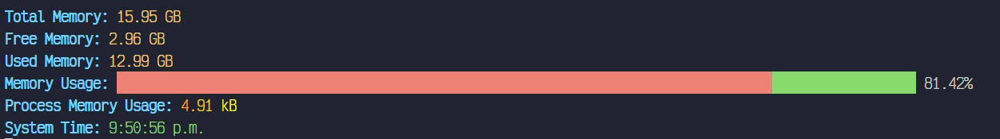

## Pasos Para Ejecutar la App
1. Instalar <code>NodeJS</code>
2. Ejecutar al mismo nivel que este archivo <code>npm install</code>
3. Ejecutar npm start

Esto genera un archivo mirificado(ocupa menos memoria) del código fuente, pero es "ilegible" para un programados

## Ejecución del Programa

    

