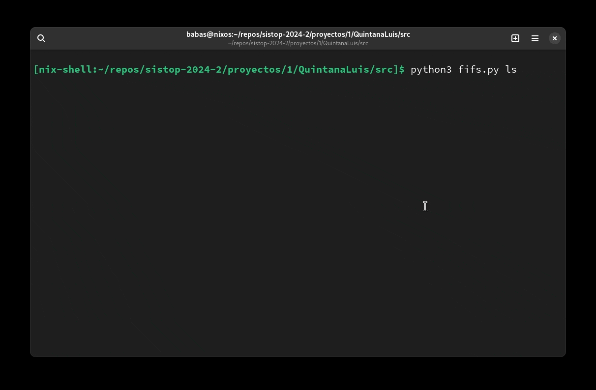

# Cli



Opciones
---

```commandline
Uso:
python3 fifs.py [push|pull|remove|ls|shell] [opciones] [archivos]

    push <archivo_origen> [archivo_destino]        copia los archivos del sistema al fi unam fs
    pull <archivo_origen> [archivo_destino]        copia los archivos de fi unam fs al sistema
    remove <archivo>                               elimina el archivo indicado de fi unam fs
    ls [-l]                                        muestra los archivos de fi unam fs, se muestran los detalles con -l
    shell                                          modo interactivo en shell personalizada

Opciones:
    -l          Mostrar detalles de archivos (solo opción ls)
```

Ejemplos de uso
---
1. Listar archivos con detalle
```commandline
python3 fifs.py ls -l
```
2. Obtener archivos de fi unam fs
```commandline
python3 fifs.py pull mensaje.jpg mensajeConOtroNombre.jpg
```
3. Obtener archivos de fi unam fs (un solo argumento)
```commandline
python3 fifs.py pull mensaje.jpg
```
4. Copiar archivos de nuestro sistema a fi unam fs
```commandline
python3 fifs.py push saludo.txt
```

5. Eliminar archivo de fi unam fs
```commandline
python3 fifs.py remove saludo.txt
```
