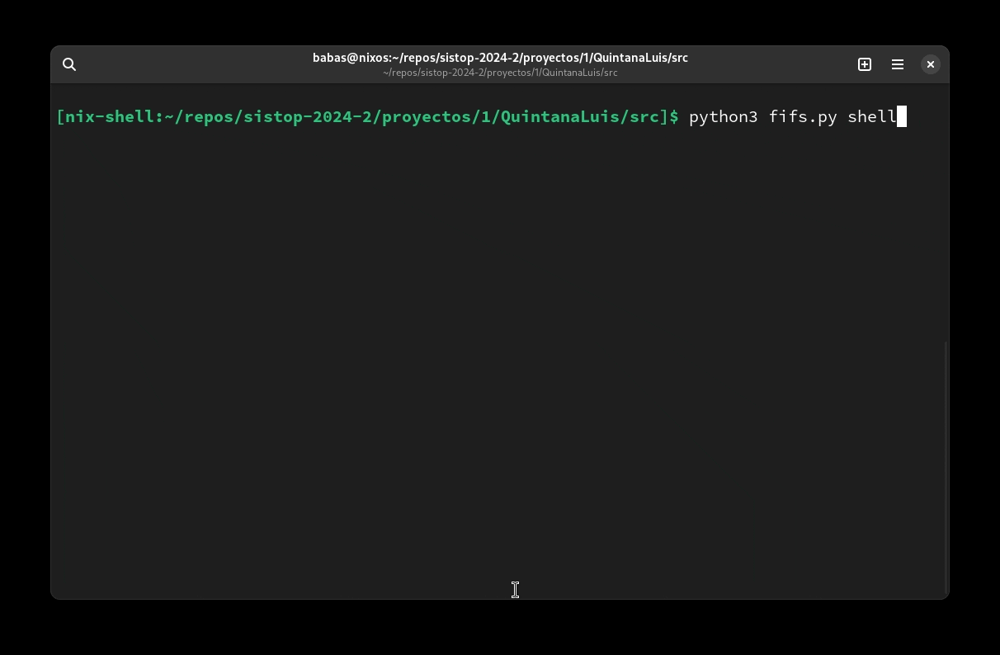

# Shell



```commandline
Uso:
python3 fifs.py shell

    push [archivo_origen] [archivo_destino]        copia los archivos del sistema al fi unam fs, solo colocando push se entra en modo interactivo
    pull [archivo_origen] [archivo_destino]        copia los archivos de fi unam fs al sistema, solo colocando pull se entra en modo interactivo
    remove [archivo]                               elimina el archivo indicado de fi unam fs, solo colocando remove|rm se entra en modo interactivo
    ls [-l]                                        muestra los archivos de fi unam fs, se muestran los detalles con -l
                                                   solo colocando remove|rm se entra en modo interactivo
    exit                                           salir del shell

Opciones:
    -f          Forzar eliminación (solo opción remove y en modo shell)
    -l          Mostrar detalles de archivos (solo opción ls)
```


Ejemplos de uso
---
1. Listar archivos con detalle
```commandline
$ ll
$ ls -l
```
2. Obtener archivos de fi unam fs
```commandline
$ pull
```
3. Copiar archivos de nuestro sistema a fi unam fs
```commandline
$ push saludo.txt
```
4. Eliminar archivo de fi unam fs
```commandline
$ rm -f saludo.txt
```